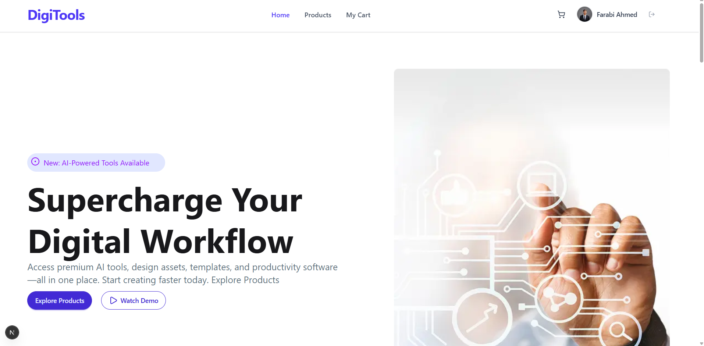

# 🛠️ My Digi Tools

A premium digital tools directory and subscription platform built with modern web technologies. Users can browse various digital tools, view details, add them to their cart, and proceed to checkout seamlessly.


Live Link: https://my-tools-ashy.vercel.app/     
GitHub repositories Link: https://github.com/farabi-x09/My-Tools
## 🚀 Features

* **Tool Directory:** Browse a wide range of premium digital tools, software, and subscriptions.
* **Product Details:** View comprehensive details, pricing, and features of each individual tool.
* **Shopping Cart System:** Add tools to the cart, view the total amount, and remove items. State is efficiently managed using React Context API and persisted via LocalStorage.
* **Protected Routes:** Critical pages like Cart and Product Details are secured using Next.js Middleware. Users must be authenticated to access them.
* **Authentication:** Secure user login and registration system powered by Better Auth.
* **Interactive UI/UX:** Real-time toast notifications (React Hot Toast) for user actions like adding/removing items or successful checkout.
* **Fully Responsive:** Beautifully designed and optimized for both mobile and desktop devices.

## 💻 Technologies Used

* **Frontend Framework:** Next.js (App Router)
* **UI Library:** React.js
* **Styling:** Tailwind CSS & DaisyUI
* **State Management:** React Context API
* **Authentication:** Better Auth
* **Notifications:** React Hot Toast
* **Icons & Assets:** Lucide React / Custom SVGs

## 🛠️ Getting Started

Follow these steps to set up and run the project locally:

### Prerequisites
Make sure you have Node.js and npm installed on your machine.

### Installation

1. **Clone the repository:**
   ```bash
   git clone [https://github.com/your-username/my-digi-tools.git](https://github.com/your-username/my-digi-tools.git)